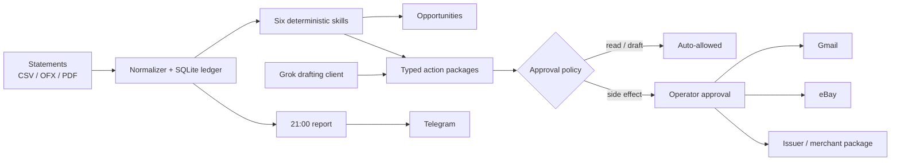

<p align="center">
  
</p>

<h1 align="center">REAPER</h1>

<p align="center"><strong>A local-first debt operations agent.</strong></p>

<p align="center">
  <a href="https://github.com/Argona7/reaper/actions/workflows/ci.yml"></a>
  <a href="LICENSE"></a>
  
  
</p>

Reaper reads card statements, builds a complete transaction map, finds money leaks,
prepares issuer negotiations, compares balance-transfer offers, assembles dispute
evidence, drafts asset listings, and sends a nightly debt report.

The project started with one instruction:

> report progress daily. don't ask me for money.

The original build log is [here](https://x.com/Argona0x/status/2093717188062458201).

## What ships

Reaper has six executable skills. Each skill emits evidence, opportunities, and typed
action packages. Side effects move through one approval ledger before a connector can
execute them.

| # | Skill | Reads | Produces |
|---|---|---|---|
| 1 | `statement-audit` | CSV, OFX/QFX, text PDF | normalized ledger, monthly baseline, anomaly candidates |
| 2 | `subscriptions` | recurring transactions | savings estimate + cancellation packages |
| 3 | `apr-negotiation` | issuer, APR, balance | three-stage retention escalation with written-term check |
| 4 | `balance-transfer` | live offer terms | fee/interest comparison + transfer package |
| 5 | `charge-dispute` | transactions + evidence | duplicate candidates + dispute packet |
| 6 | `asset-liquidation` | operator-selected assets | priced eBay inventory/offer package |

Also included:

- xAI/Grok drafting client with JSON output and fact-only constraints;
- Gmail OAuth connector for approved outbound messages;
- eBay Sell Inventory API connector for approved listings;
- Telegram report at a configurable local hour (21:00 by default);
- SQLite audit trail with idempotency keys and append-only action events;
- FastAPI approval console and machine-readable API;
- Docker, CI, typed config, tests, and synthetic example data.

## Run it

Python 3.11+ and [`uv`](https://docs.astral.sh/uv/) are the fastest path:

```bash
git clone https://github.com/Argona7/reaper.git
cd reaper
uv sync --extra dev
uv run reaper init
uv run reaper import examples/statements/demo.csv
uv run reaper run \
  --inputs examples/offers.yaml \
  --inputs examples/assets.yaml
uv run reaper actions --status proposed
uv run reaper serve
```

Open `http://127.0.0.1:8787` for the debt dashboard and approval queue.

The demo statement is synthetic. Your imported statement files, database, OAuth tokens,
and evidence stay in ignored local paths.

## One real run, end to end

```bash
# 1. Copy the config and set the real debt snapshot.
uv run reaper init
$EDITOR reaper.yaml

# 2. Import statement exports. Re-imports are idempotent.
uv run reaper import ~/Downloads/card-2025.csv
uv run reaper import ~/Downloads/card-2026.qfx

# 3. Run every skill. Optional inputs add current offers and selected assets.
uv run reaper run --inputs offers.yaml --inputs assets.yaml

# 4. Inspect exact payloads before any external action.
uv run reaper actions --status proposed
uv run reaper export-action <ACTION_ID> .reaper/review/<ACTION_ID>.json

# 5. Approve one payload, then execute it through its configured connector.
uv run reaper approve <ACTION_ID> --actor argona
uv run reaper execute <ACTION_ID>

# 6. Generate the nightly message or send it through Telegram.
uv run reaper report --freed-today 31
uv run reaper report --freed-today 31 --send
```

## Approval boundary

The model never decides its own permissions. `ApprovalPolicy` is deterministic and lives
outside Grok.

| Operation | Default |
|---|---|
| read, analyze, calculate | automatic |
| draft, report | automatic |
| send email | operator approval |
| cancel a service | operator approval |
| submit a dispute | operator approval |
| transfer a balance or make a payment | operator approval |
| publish/edit/delete a listing | operator approval |
| spend money | operator approval |

An approval covers one immutable action payload, expires, and is recorded with actor,
timestamp, decision, and reason. Changing the payload creates a new idempotency key and a
new approval request. See [`docs/approval-model.md`](docs/approval-model.md).

## APR retention sequence

The exact three-message sequence is public:

1. [`initial retention review`](playbooks/apr-retention/01-initial-retention.md)
2. [`supervisor escalation`](playbooks/apr-retention/02-supervisor-escalation.md)
3. [`written terms confirmation`](playbooks/apr-retention/03-written-confirmation.md)

Templates request the lowest account-level rate, enumerate the terms that must be
confirmed, and prevent a product change, closure, or credit inquiry from being treated as
implicit consent.

## Architecture



The model drafts language. Python owns arithmetic, transaction fingerprints, recurring
charge detection, offer comparisons, permissions, idempotency, and state transitions.

## Configuration

Start from [`reaper.yaml.example`](reaper.yaml.example). Secrets are environment variables;
account data and tokens are never committed.

```yaml
owner:
  timezone: America/New_York
  report_hour: 21

agent:
  name: Reaper
  model: grok-4
  database: .reaper/reaper.sqlite3

approval:
  require_for: [send_email, cancel_service, submit_dispute, transfer_balance,
                make_payment, publish_listing, edit_listing, delete_listing, spend]
```

Connector setup is in [`docs/connectors.md`](docs/connectors.md). The complete operating
sequence is in [`docs/runbook.md`](docs/runbook.md).

## Repository map

```text
src/reaper/
├── parsers/          statement normalization with source evidence
├── skills/           six deterministic debt skills
├── connectors/       Gmail, Telegram, eBay
├── approvals.py      side-effect policy boundary
├── engine.py         orchestration + execution state machine
├── db.py             SQLite ledger and audit log
├── reporting.py      debt projection + nightly report
├── api.py            FastAPI approval console
└── cli.py            reaper commands
playbooks/
├── apr-retention/    public email sequence
└── skills/           machine-readable skill contracts
```

## Development

```bash
make install
make check
make demo
```

`make check` runs Ruff, mypy, pytest with coverage, build verification, and `pip-audit`.

## Status

Working now: local statement ingestion, all six skills, calculations, approval ledger,
action export, Gmail send, eBay publish, Telegram reporting, API/dashboard, and scheduler.

Next: shared anonymized win records, issuer-specific adapters, and a public aggregate
counter for verified principal reduction.

## License

Apache-2.0. See [`LICENSE`](LICENSE).

